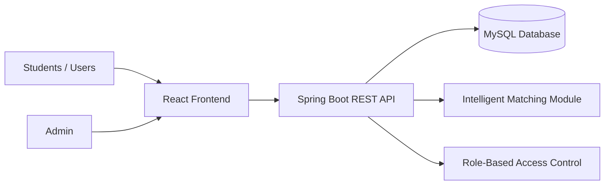

<div align="center">

# Claimify - Intelligent Lost & Found Locator

### Smart, secure, and community-driven lost & found platform for campus environments

<p>
  <a href="https://github.com/Praveena-code/lost-found-claimify">
    
  </a>
</p>

</div>

---

## ��� Project Overview

**Claimify** is a modern web-based lost & found platform that helps students and staff quickly report, discover, and recover misplaced items on campus.

The system provides:
- Structured posting for lost and found items
- Intelligent matching between related reports
- Role-based access control for secure usage
- Admin dashboard for moderation and oversight

This project demonstrates full-stack engineering with a real-world campus use case, making it ideal for a recruiter-facing portfolio.

---

## ✨ Key Features

- Report **Lost Items** and **Found Items** with detailed metadata
- Search and filter listings by category, date, location, and status
- Intelligent matching suggestions to connect possible item pairs
- Secure authentication and authorization with role-based permissions
- User dashboard for tracking report history and item status
- Admin dashboard for managing reports, users, and platform activity
- Responsive interface for desktop and mobile access

---

## ���️ Tech Stack (Badges)

<div align="center">


</div>

---

## ��� System Architecture



**Architecture summary**
- **Frontend:** React application for users and admins
- **Backend:** Spring Boot REST APIs handling business logic
- **Database:** MySQL for users, reports, matches, and status
- **Core Services:** Matching logic + role-based permissions

---

## ��� Project Structure

```text
CampusTrack/
├── README.md
├── LICENSE
├── .gitignore
├── docs/
│   ├── architecture/                 # Diagrams and architecture notes
│   ├── api/                          # Postman collections / API docs
│   └── assets/                       # Additional docs assets
├── backend/                          # Spring Boot backend
│   ├── pom.xml
│   └── src/
│       ├── main/
│       │   ├── java/com/campustrack/
│       │   │   ├── config/           # Security and app configuration
│       │   │   ├── controller/       # REST controllers
│       │   │   ├── dto/              # Request/response objects
│       │   │   ├── entity/           # JPA entities
│       │   │   ├── exception/        # Global/custom exceptions
│       │   │   ├── repository/       # Data access layer
│       │   │   ├── service/          # Business logic
│       │   │   └── CampusTrackApplication.java
│       │   └── resources/
│       │       ├── application.yml
│       │       └── db/migration/     # Flyway/Liquibase scripts
│       └── test/                     # Unit and integration tests
├── frontend/                         # React frontend
│   ├── package.json
│   ├── public/
│   └── src/
│       ├── api/                      # API client layer
│       ├── assets/                   # Images/icons/fonts
│       ├── components/               # Reusable components
│       ├── features/                 # Domain modules
│       ├── layouts/                  # Layout wrappers
│       ├── pages/                    # Route-level pages
│       ├── routes/                   # Routing + guards
│       ├── store/                    # State management
│       ├── styles/                   # CSS files
│       ├── utils/                    # Utility functions
│       ├── App.jsx
│       └── main.jsx
├── database/
│   ├── schema.sql                    # Database schema
│   └── seed.sql                      # Optional sample data
└── .github/
    └── workflows/
        └── ci.yml                    # CI pipeline
```

---

## ⚙️ Installation & Setup

### 1. Clone Repository
```bash
git clone https://github.com/Praveena-code/lost-found-claimify.git
cd lost-found-claimify
```

### 2. Backend Setup (Spring Boot)
```bash
cd backend
# Update DB credentials in src/main/resources/application.yml
mvn clean install
mvn spring-boot:run
```

### 3. Frontend Setup (React)
```bash
cd frontend/lostfound-front
npm install
npm run dev
# or npm start (based on your setup)
```

### 4. Access Application
- Frontend: `http://localhost:3000` (or Vite default `http://localhost:5173`)
- Backend: `http://localhost:8080`

---

## ��� API Endpoints

| Method | Endpoint | Description | Access |
|---|---|---|---|
| `POST` | `/api/auth/register` | Register a new account | Public |
| `POST` | `/api/auth/login` | Authenticate user and issue token | Public |
| `POST` | `/api/items/lost` | Create a lost item report | User |
| `POST` | `/api/items/found` | Create a found item report | User |
| `GET` | `/api/items` | Get/search all item reports | User/Admin |
| `GET` | `/api/items/{id}` | Get report details by ID | User/Admin |
| `PUT` | `/api/items/{id}` | Update report | Owner/Admin |
| `DELETE` | `/api/items/{id}` | Delete report | Owner/Admin |
| `GET` | `/api/matches/{itemId}` | Get intelligent match suggestions | User/Admin |
| `GET` | `/api/admin/reports` | Admin moderation/report listing | Admin |

> Update endpoint names if your controller mappings are different.

---

## ��� User Roles

| Role | Permissions |
|---|---|
| **Student / User** | Register/login, create lost/found reports, browse/search reports, manage own posts |
| **Admin** | Moderate listings, verify reports, manage users, monitor platform insights |

---

## ��� Future Improvements

- AI-assisted image comparison for better match confidence
- Real-time chat between finder and claimant
- Email/SMS notifications for potential matches
- Campus map integration for precise location tagging
- Multi-campus support with organization-level segregation
- Advanced analytics for recovery rates and trends

---

## ��� Contributors

- **Praveena** - Full Stack Developer  
  GitHub: `https://github.com/Praveena-code`

Contributions are welcome.
1. Fork the repo
2. Create a feature branch
3. Commit your changes
4. Open a Pull Request

---

## ��� License

This project is licensed under the **MIT License**.  
See the `LICENSE` file for complete details.

---

<div align="center">

</div>
